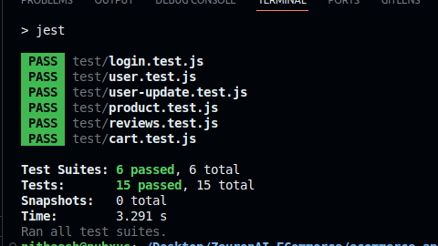

# E-commerce Backend System

## Introduction
This application provides backend functionalities for managing users, products, carts, and reviews in an e-commerce environment. It includes authentication, CRUD operations for products, cart management, and user reviews.

## Project Overview
The E-commerce Backend System is designed to support the functionalities of an online store, providing endpoints for user management, product catalog management, shopping cart operations, and product reviews. The system is built using Node.js, Express, and SQLite.
## Prerequisites
- Node.js (version 21.7.1 or higher)
- npm (version 10.5.0 or higher)
- SQLite (version 3.37.2 or higher)

## Setup
To set up the project locally, follow these steps:

1. **Clone the repository:**
```bash
git clone https://github.com/NitheeshwarBR/ZeuronAI-ECommerce

cd ecommerce-app
```

2. **Install dependencies:**
```bash
npm install
```

3. **Set up the database:**
- Ensure SQLite is installed.
- Run the database setup script:

```bash
 node database/db-setup.js
  ```
  
  4. **Start the Backend Server**
```bash
  node index.js
```
---
## Testing
**Testing is implemented using Jest and Supertest to ensure that all backend functionalities work as expected under various conditions**
### Running Tests
- To run all tests, use the following command:
```bash
npm test
```
- To run specific tests, specify the test file:
```bash
npm test -- tests/<test_file>.js
```
##### Test Results

---
## API Endpoints

### Authentication
- `POST /api/signup`: Create a new user account.
- `POST /api/login`: Authenticate and log in a user.
- `POST /api/logout`: Log out the authenticated user.
- `PUT /api/update-username`: Update the username for the authenticated user.
- `PUT /api/update-password`: Update the password for the authenticated user.

### Products Management
- `POST /api/products`: Add a new product to the store.
- `GET /api/products`: Retrieve all products from the store.
- `GET /api/products/search?q=query`: Search products by title or description.
- `GET /api/products/:productId`: Retrieve a product by its ID.

### Cart Management
- `POST /api/cart`: Add a product to the user's cart.
- `GET /api/cart`: Retrieve all items in the user's cart.
- `DELETE /api/cart/:cartItemId`: Remove an item from the user's cart.

### Review Management
- `POST /api/reviews`: Add a review for a product.
- `GET /api/reviews/:productId`: Retrieve reviews for a specific product.

## Database Structure
The application uses SQLite database with the following structure:

### Users Table
- `id` (INTEGER, primary key): User ID
- `username` (TEXT, unique): Username
- `password` (TEXT): Hashed password

### Products Table
- `id` (INTEGER, primary key): Product ID
- `image` (TEXT): URL of the product image
- `title` (TEXT): Title of the product
- `description` (TEXT): Description of the product
- `price` (REAL): Price of the product
- `category` (TEXT): Category of the product

### Cart Table
- `id` (INTEGER, primary key): Cart item ID
- `user_id` (INTEGER, foreign key to Users(id)): User ID who owns the cart item
- `product_id` (INTEGER, foreign key to Products(id)): Product ID in the cart
- `quantity` (INTEGER): Quantity of the product in the cart

### Reviews Table
- `id` (INTEGER, primary key): Review ID
- `user_id` (INTEGER, foreign key to Users(id)): User ID who posted the review
- `product_id` (INTEGER, foreign key to Products(id)): Product ID being reviewed
- `rating` (INTEGER): Rating given in the review (1-5)
- `comment` (TEXT): Review comment
- `date_of_review` (TEXT): Date and time when the review was posted

---
## User Management

#### Signup
- **Endpoint:** `POST /auth/signup`
- **Description:** Creates a new user account.
- **Request Body Structure:**
```json
{
 "username": "example_user",
 "password": "password123"
}
```

#### Login
- **Endpoint:** `POST /auth/login`
- **Description:** Authenticates and logs in a user.
- **Request Body Structure:**
```json
{
 "username": "example_user",
 "password": "password123"
}
```


#### Logout
- **Endpoint:** `POST /auth/logout`
- **Description:**  Logs out the authenticated user.
```bash
curl -X POST http://localhost:3001/api/logout -H 'Authorization: Bearer <token>'
```


#### Update Username
- **Endpoint:** `PUT /auth/update-username`
- **Description:**  Updates the username for the authenticated user.
- **Request Body Structure:**
```bash
{
  "newUsername": "new_example_user"
}
```


#### Update Password
- **Endpoint:** `PUT /auth/update-password`
- **Description:**  Updates the password for the authenticated user.
- **Request Body Structure:**
```bash
{
  "newPassword": "new_password123"
}

curl -X PUT http://localhost:3001/auth/update-password -d '{"newPassword": "new_password123"}' -H 'Authorization: Bearer <token>' -H 'Content-Type: application/json'

```

---
## Product Management
#### Add Product
- **Endpoint:** `POST /products`
- **Description:**  Adds a new product to the store.
- **Request Body Structure:**
```bash
{
  "image": "product_image_url",
  "title": "New Product",
  "description": "Product description",
  "price": 99.99,
  "category": "Electronics"
}
```
```bash

curl -X POST http://localhost:3000/api/products -d '{"image": "product_image_url", "title": "New Product", "description": "Product description", "price": 99.99, "category": "Electronics"}' -H 'Authorization: Bearer <token>' -H 'Content-Type: application/json'

```
#### List Product
- **Endpoint:** `GET /products`
- **Description:**  Retrieves all products from the store.
- **Request Body Structure:**
```bash
curl -X GET http://localhost:3001/products
```

#### Search Products
- **Endpoint:** `GET /products/search?q=query`
- **Description:**  Searches products by title or description.
- **Request Body Structure:**
```bash
curl -X GET "http://localhost:3001/api/products/search?q=product_name"

```

#### Get Product By ID
- **Endpoint:** `GET /products/:productId`
- **Description:**  Retrieves a product by its ID.
- **Request Body Structure:**
```bash
curl -X GET http://localhost:3000/api/products/1

```
---
## Cart Management

#### Add to Cart
- **Endpoint:** `POST /cart`
- **Description:** Adds a product to the user's cart.
- **Request Body Structure:**
```bash
{
  "userId": 1,
  "productId": 1,
  "quantity": 2
}
```
```bash
curl -X POST http://localhost:3001/cart -d '{"userId": 1, "productId": 1, "quantity": 2}' -H 'Authorization: Bearer <token>' -H 'Content-Type: application/json'
```
#### Get Cart Items
- **Endpoint:** `GET /cart`
- **Description:** Retrieves all items in the user's cart.
- **Request Body Structure:**
```bash
curl -X GET http://localhost:3001/cart -H 'Authorization: Bearer <token>'
```
#### Remove Cart Items
- **Endpoint:** `DELETE /cart/:cartItemId`
- **Description:** Removes an item from the user's cart.
- **Request Body Structure:**
```bash
curl -X DELETE http://localhost:3001/cart/1 -H 'Authorization: Bearer <token>'

```
---
## Reviews Management
#### Add Reviews
- **Endpoint:** `POST /reviews`
- **Description:** Adds a review for a product.
- **Request Body Structure:**
```bash
{
  "userId": 1,
  "productId": 1,
  "rating": 5,
  "comment": "Great product!"
}
```
```bash
curl -X POST http://localhost:3001/reviews -d '{"userId": 1, "productId": 1, "rating": 5, "comment": "Great product!"}' -H 'Authorization: Bearer <token>' -H 'Content-Type: application/json'

```
#### List Reviews
- **Endpoint:** `GET /reviews/:productId`
- **Description:** Retrieves reviews for a specific product.
- **Request Body Structure:**
```bash
curl -X GET http://localhost:3001/reviews/1

```
---
## Security 
#### Authentication
- **Authentication:** JSON Web Tokens (JWT) are utilized for secure authentication of users. Upon successful login, a JWT token is issued, which must be included in the `Authorization` header of subsequent requests to authenticate the user. This token is verified using the `authenticateToken` middleware before granting access to protected endpoints.

#### Password Security
- **Password Security:** User passwords are securely hashed using bcrypt.js before being stored in the database. This ensures that even if the database is compromised, user passwords remain protected from unauthorized access.

#### Middleware Configuration
- **CORS (Cross-Origin Resource Sharing) Configuration:** CORS middleware is configured to allow requests only from specified origins (`http://localhost:3001`) and with credentials (`credentials: true`). This prevents unauthorized cross-origin requests and enhances the security of the application.

#### Error Handling
- **Error Handling:** The application provides appropriate HTTP status codes (`200 OK`, `201 Created`, `404 Not Found`, `500 Internal Server Error`, etc.) to indicate the success or failure of requests. Proper error handling ensures that clients receive meaningful responses and helps in securing the application against potential vulnerabilities.


